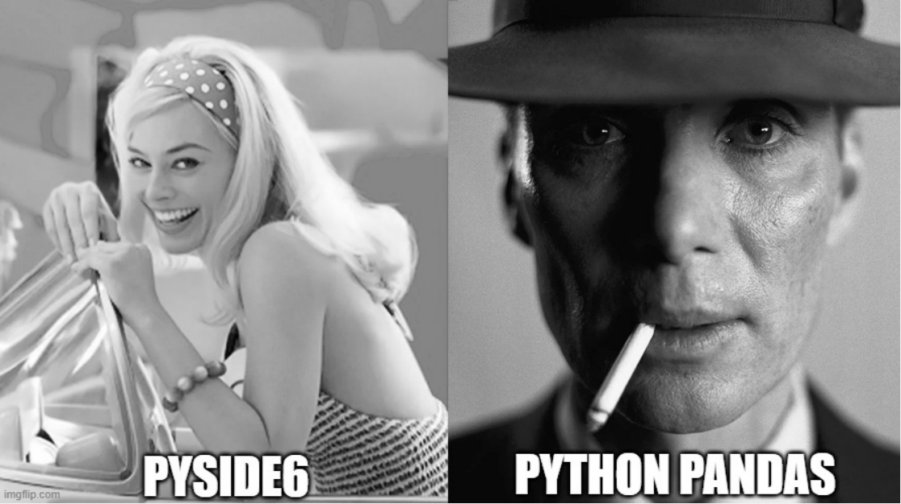
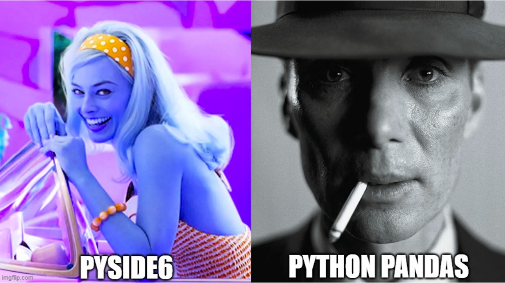
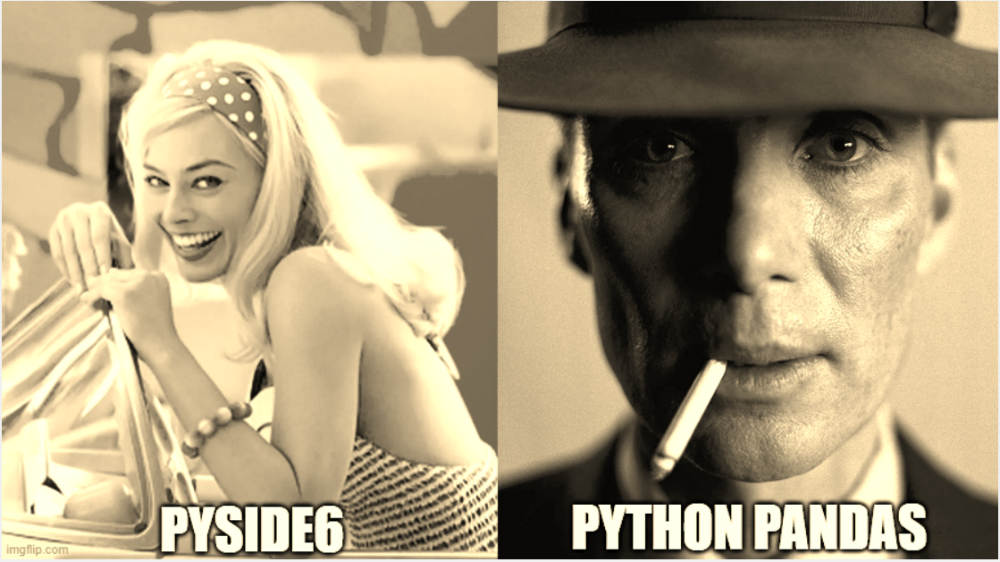
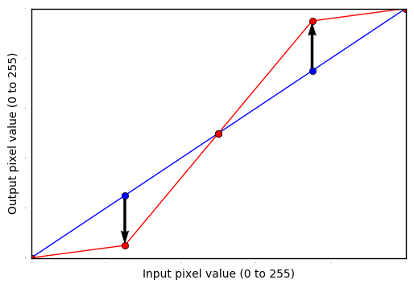
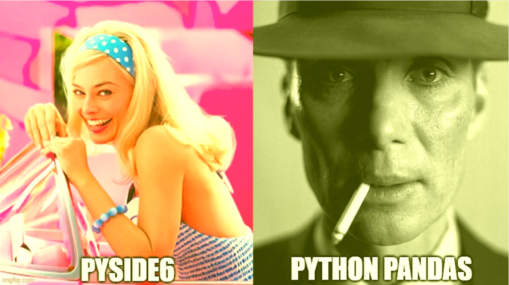

# 420-SD3-HY-TP1

## InstaFiltres: Recréer des filtres instagram
Les filtres photos sont utilisés en photographies (et en cinématographie) depuis longtemps. Des filtres de couleur
placés devant la lentille, utilisation d'une lumière ambiante orange, le procédé autochrome, le procédé Kodak, etc.

Depuis les débuts de la photographie numérique, on a recréé ces filtres analogiques en plus d'en concenvoir de nouveaux
basés sur des calculs mathématiques ou maintenant avec l'intelligence artificiel et l'apprentissage machine (ML).  

# Survol de l'application à concevoir
Vous allez concevoir une application graphique qui devra appliquer des filtres sur une image.

## Comprendre les formats graphiques
Le format graphique utilisé sera le [PNG](https://fr.wikipedia.org/wiki/Portable_Network_Graphics). Ce format libre de 
droits fait partie des formats les plus utilisés sur le web. Il possède plusieurs avantages et permet un bon compromis
entre une bonne qualité et une bonne compression (sans perte).

### Rouge, Vert et Bleu
Sans trop entrer dans les détails du format de fichier, la palette de couleurs disponibles est défini en utlisant le
format RGB (Rouge Vert Bleu). Le format RGB est un principe de couleurs additives (on mélange le rouge, le vert et le
bleu en diverses proportions pour obtenir des couleurs). Plusieurs formats RGB sont possibles d'être utilisés par les
PNG. Dans le cas de ce TP, on va se limiter à un format en particulier: RGB32 (RGB 32bit).  

Si vous regarder les propriétés du fichier 'barbenheimer.png', cela indiquera une profondeur de couleur de 24bits.
Pour comprendre ceci, on peut regarder la documentation de
[QImage](https://doc.qt.io/qtforpython-5/PySide2/QtGui/QImage.html) pour ce format:  

32bits = 4 * 8bits = 4 octets (bytes).  

En regardant le format, le premier octet est inutilisé (0xFF = 255), ensuite on a les canaux de couleurs:  
1 octet pour le rouge (donc, valeur entre 0 et 255)  
1 octet pour le vert (donc, valeur entre 0 et 255)  
1 octet pour le bleu (donc, valeur entre 0 et 255)  

## L'application à concevoir

Vous devez concevoir une application PySide6 qui utilisera des widgets pour contrôler les filtres que vous aurez
programmés et les appliquer sur l'image.  

L'application ne peut qu'utiliser que PySide6 et aucune autre bibliothèques externes à moins de mention dans les
instructions.

## Critères d'évaluation

Ce TP compte pour 15% de la note finale.

La répartions des critères d'évaluation est comme suit:  

7% pour le fonctionnement de l'interface utilisateur    
5% pour le fonctionnement des filtres  
3% pour le respect des normes Python et la documentation

Comme nous n'avons pas encore vu le détails des dispositions (layout), la beauté et l'expérience utilisateur de
l'interface graphique ne seront pas évalués (faites quand même petit effort ;) )  

L'application devra avoir les points suivants:  
1) Un QLabel nommé "etiquette_image" qui affichera l'image "barbenheimer.png" (déjà instancié dans le constructeur)
2) Un QLabel "Nuances de gris" et deux boutons radios, "oui" et "non", qui seront dans un QButtonGroup
   1) Lorsque "oui" est sélectionné, le filtre "NuancesGrisFiltre" sera appliqué
   2) Lorsque non est sélectionné, le filtre ne sera pas appliqué
   3) "Non" sera sélectionné par défaut
3) Une case à cocher "Sepia"
   1) Lorsque cochée, le filtre "SepiaFiltre" sera appliqué; dans le cas contraire, le filtre ne sera pas appliqué 
   2) Ne sera pas cochée par défaut
4) Une case à cocher "RGB Swap"
   1) Lorsque cochée, le filtre "RGBSwapFiltre" sera appliqué; dans le cas contraire, le filtre ne sera pas appliqué
   2) Ne sera pas cochée par défaut
5) Une case à cocher "Interpolation Linéaire"
   1) Ne sera pas cochée par défaut
   2) Lorsque non cochée, la liste déroulante et le QSpinBox seront désactivés et le filtre ne sera pas appliqué
   3) Lorsque cochée, la liste déroulante et le QSpinBox seront activés et le filtre InterpolationFiltre sera activé
6) Une liste déroulante non-éditable contenant les items "Rouge", "Vert" et "Bleu"
   1) Sera désactivée par défaut
   2) Lorsque activée, la valeur du QSpinBox devra être la valeur précédente pour la couleur sélectionnée
   3) Permet de sélectionner une couleur dont la valeur correspondante sera appliquée au filtre
7) Un QSpinBox qui permettra de capturer la valeur de l'interpolation de la couleur sélectionnée
   1) Sera désactivé par défaut
   2) La valeur par défaut pour chaque couleur sera 0
   3) La valeur maximale pour chaque couleur sera 255
   4) La valeur minimale pour chaque couleur sera -255
8) Une barre de menu contenant le menu "Fichier"
   1) Contient une action "Quitter" qui fermera l'application
9) La fenêtre principale devra avoir comme titre "InstaFiltres"
10) Une barre de statut
    1) Lorsque le filtre "Interpolation Linéaire" sera activé, ajouter une barre de progression qui augmentera au fur et
      à mesure que chaque ligne de pixels (la hauteur) sera traitée (voir le filtre). Une fois complété, la faire disparaitre.
11) L'entête du fichier devra contenir les nom complets et les nom d'usager GitHub de chaque membre de l'équipe.

## Des mathématiques et des filtres...

La majorité des filtres de bases sont des calculs mathématiques ou une application de fonctions sur des pixels de
couleurs. Voici les filtres que nous allons implémentés:

### Structure des Filtres
Une classe abstraite AbstractFiltre vous est fournie qui déclare une méthode abstraite   
`def appliquer_filtre(self, qpixmap: QPixmap,  params: {}) -> QPixmap:`

Chaque Filtre sera implémenté dans sa propre classe qui héritera de la classe abstraite. L'implémentation se fera donc
à l'intérieur de la méthode appliquer_filtre. Comme indiqué, la méthode prend en paramètre un QPixmap et des paramètres
et doit retourner le QPixmap modifié.

Une méthode "appliquer_filtres()" dans l'application vous est aussi fournie pour appliquer tous les filtres se trouvant
dans le dictionnaire "self.dict_filtres". Pour appliquer un filtre, vous avez besoin seulement de l'ajouter dans le
dictionnaire:  
>mon_filtre = MonFiltre()  
>self.dict_filtres["mon_super_filtre"] = [mon_filtre, {}]

La valeur de la clé du dictionnaire comprend l'instance de la classe et un dictionnaire pouvant être utilisé pour passer
des paramètres au filtre.

Pour ne plus l'appliquer, le retirer du dictionnaire.

### Nuances de gris
Le filtre classique. Celui-ci remplace les couleurs par un ton de gris correspondant. Dans ce cas-ci,
[QImage](https://doc.qt.io/qtforpython-6/PySide6/QtGui/QImage.html#qimage) vous permet de facilement appliquer celui-ci
(littéralement une ligne).

### RGB swap
Le filtre inverse les couleurs rouge et bleu. Dans ce cas-ci,
[QImage](https://doc.qt.io/qtforpython-6/PySide6/QtGui/QImage.html#qimage) vous permet de facilement appliquer celui-ci
(littéralement une ligne).

### Sepia
Un filtre qui donne un vieux look à une image. Le filtre est le résultat du produit matriciel entre la matrice RGB du
pixel et la matrice [Sepia](https://www.w3.org/TR/filter-effects-1/#sepiaEquivalent). La résultante de ce produit est:
>rouge_sepia = int(rouge * 0.393 + vert * 0.769 + bleu * 0.189)  
>vert_sepia = int(rouge * 0.349 + vert * 0.686 + bleu * 0.168)  
>bleu_sepia = int(rouge * 0.272 + vert * 0.534 + bleu * 0.131)  

Si le résultat d'une multiplication donne plus que 255, la valeur doit être 255.

Pour ce faire, vous devrez modifier pixels par pixel la couleur (voir plus bas).

### Interpolation Linéaire
L'interpolation linéaire est une fonction mathématique qui permet de déterminer l'écart de valeurs possibles d'une
fonction. Dans notre cas, il faut voir cela comme une nouvelle fonction qui permet de remplacer les valeurs d'une droite
par d'autres valeurs.
 
voir [ici](https://www.practicepython.org/blog/2016/12/20/instagram-filters-python.html) pour plus de détails ou 
[wikipédia](https://fr.wikipedia.org/wiki/Interpolation_lin%C3%A9aire)

Dans notre cas, on va simplifier la méthode pour ajuster l'entièreté de la droite par une constante (on déplace la
droite).

Entre d'autres mot, pour chaque pixel, pour chaque couleur, on va additionner (ou soustraire) une valeur sélectionnée
par l'utilisateur.  

Pour ce faire, vous devrez modifier pixels par pixel la couleur (voir plus bas)

### Colorer des pixels
Une fois que le QPixmap est converti en QImage, on a accès à plus d'information et de possibilités de transformation de
l'image. L'image a une hauteur (height) et une largeur (width). L'image se lit de gauche à droite et de bas en haut (
en d'autres mots, le point 0,0 est en haut à gauche).

qimage a une fonction pixel(x, y) qui permet de retourner le pixel à l'emplacement x,y. Une fois que l'on a un pixel, il
est possible d'extraire chaque couleur en suivant le format RGB comme suit:
>pixel = qimage.pixel(w, h)  
>rgb_bytes = pixel.to_bytes(4, "big")  
> rouge = rgb_bytes[1]  
> vert = rgb_bytes[2]  
> bleu = rgb_bytes[3]  

Il est donc possible d'itérer pour chaque pixel et aller changer la valeur de l'octet (
rappel: un octet correspond à une valeur numérique de 0 à 255). Noter aussi que l'on ignore le premier byte (voir
format RGB). À noter que lire pixel par pixel n'est pas une méthode efficace mais par contre simple; il existe d'autres
méthodes pouvant être utilisées pour lire les pixels.

## Remise du TP
Comme le TP est sur GitHub Classroom, les push seront bloqués à la date limite du TP. La dernière version dans la
branche "main" sera corrigé. Vous devez simplement cloner le dépot de votre équipe et faire des "push" sur le dépôt. 

